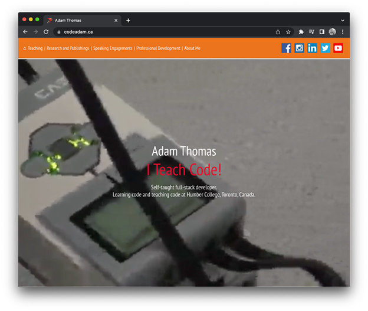

# Vanilla HTML Version of codeadam.ca

This repository stores the plain HTML version of [codeadam.ca](https://codeadam.ca). The pages include samples of each different layout style using HTML, CSS, and w3.css.

> The website is available at:
> https://codeadam.ca

---

## Repo Resources

- [Visual Studio Code](https://code.visualstudio.com/)
- [w3.css](https://www.w3schools.com/w3css/defaulT.asp)

